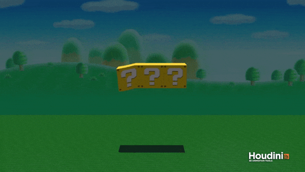
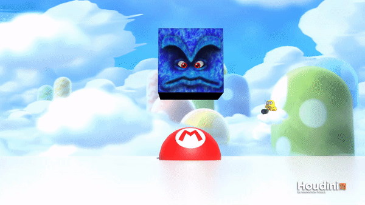

# Tasty
## 3D Deformable Solid Simulator (FEM)

## Demos
*All demos were rendered in Houdini.*

[Youtube Playlist](https://www.youtube.com/watch?v=z2EsRtdZlbw&t=0s&index=1&list=PLUNegSVHL7HHBmUMiakQnGe770Lrdw7uP)

## Implementation Details

### `particles.h`

The `Particles` class contains a vector of positions, velocities, accelerations, and forces. The `Particles::tick`
function performs numerical integration to calculate updated acceleration, velocity, and position values for each
particle. It also handles collisions with the ground and other objects in the scene.

Forces can be set to (0, 0, 0) via the `Particles::resetForces` function. A force can be added to a particular
particle, and to all particles (`Particles::addUniformForce`).

### `tetra.h`

### `main.cpp`

The main procedure of the simulation is as follows:

- Tetrahedralize mesh
- Create a particles structure containing elements in the .node file
	- Initialize the particle's velocity, acceleration, and force to 0
	- Initialize the particle's mass to 0
- Create a tetra structure for each tetrahedron in the .ele file
	- For each tetra, compute Dm and W
	- Add (density * W) / 4 to the mass of each particle
- At each timestep:
	- Reset all forces
	- Add gravitational force
	- Calculate internal elastic forces
	- Update kinematics and fix collisions

## Resources

- [_FEM Simulation of 3D Deformable Solids: A practitioner's guide to theory, discretization and model reduction_](http://femdefo.org), E. Sifakis and J. Barbič, (2012).
- Ladislav Kavan's PBA 2014 Lectures
	- [Part 1](https://youtu.be/SACGMSZx4FY)
	- [Part 2](https://youtu.be/BH1OrCtaPjo)

### Credits
- [Luxo Ball Wallpaper](https://www.wallpaperup.com/15800/Clouds_wall_toy_story.html)
- [? Block Background](https://opengameart.org/content/mario-style-platform-set)
- [? Block Ground](https://www.roblox.com/library/33329212/Paper-Mario-64-Grass)
- [Thwomp Background](http://fantendo.wikia.com/wiki/File:NSMBU_Sky_Background_1.png)
- [Thwomp Background - Lakitu](http://super-mario-64-official.wikia.com/wiki/File:Lakitu_N64.png)
- [Mario Symbol](https://ih1.redbubble.net/image.16522589.5972/sticker,375x360-bg,ffffff.png)
- [Marble Texture](http://www.powerpointhintergrund.com/ppt-image/-textures-flat-marble-texture-textures-whitemarble-white-marble-texture-6162.html)
- [Stanford Bunny](http://graphics.stanford.edu/data/3Dscanrep/)
	- Holes were manually filled in Maya