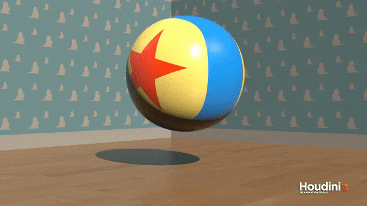

# Tasty - 3D Deformable Solid Simulator (FEM)
## Alexander Chan, Tabatha Hickman, Jacob Snipes, Emily Vo

## Demos
*All demos were rendered in Houdini.*

Click the gif to see the corresponding uncompressed video. Click
[here](https://www.youtube.com/watch?v=z2EsRtdZlbw&t=0s&index=1&list=PLUNegSVHL7HHBmUMiakQnGe770Lrdw7uP) for the full video playlist.

| Luxo Ball | Stanford Bunny |
|:---------:|:--------------:|
|||

| ? Block (Constraints) | Thwomp (Sphere Collision) |
|:---------:|:--------------:|
|||

## Implementation Details

### `particles.h`

The `Particles` class contains a vector of positions, velocities, accelerations, and forces. The `Particles::tick`
function performs numerical integration to calculate updated acceleration, velocity, and position values for each
particle. It also handles collisions with the ground and other objects in the scene.

Forces can be set to (0, 0, 0) via the `Particles::resetForces` function. A force can be added to a particular
particle, and to all particles (`Particles::addUniformForce`).

### `tetra.h`

The `Tetra` class represents a tetrahedron. It contains 4 particle indices, a mass, and various member functions to
compute
*Ds*, *P*, and *H*. `Tetra::computeElasticForces` will calculate the elastic forces on each of the four
vertices of the tetrahedron and add the forces to their respective particles in the contained `Particle` class.

### `main.cpp`

The main procedure of the simulation is as follows:

- Tetrahedralize mesh
- Create a particles structure containing elements in the .node file
	- Initialize the particle's velocity, acceleration, and force to 0
	- Initialize the particle's mass to 0
- Create a tetra structure for each tetrahedron in the .ele file
	- For each tetra, compute *Dm* and *W*
	- Add *(density * W) / 4* to the mass of each particle
- At each timestep:
	- Reset all forces
	- Add gravitational force
	- Calculate internal elastic forces
	- Update kinematics and fix collisions

We use a forward Euler integrator with the Neo-Hookean elastic model for all the demos. Constraints are handled
by simply not updating constrained particle's accelerations, velocities, or positions. Collisions are handled
with planes and spheres by detecting if a particle's position is inside the object and its velocity is moving
against the normal of the object at the point of intersection, then setting the velocity to 0.

## Struggles
- Phantom elastic forces
	- Caused by using `==` instead of `=` when resetting forces
	- Caused the mesh to explode or collapse
- Inverting tetrahedrons
	- Caused by using elastic models other than Neo-Hookean
- Improper meshes with self intersections and holes
	- Manually fixed meshes in Maya
- NaN values
	- Timestep too large for forward Euler integration
	- Tiny forces caused by floating point error, used an epsilon to discard small forces
- Low Young's modulus values
	- Caused simulation to look bad

## Contributions
- Alexander Chan
	- Setting up project and base code
	- Implementing all the elastic models in the 2012 SIGGRAPH course notes
	- Debugging
	- Scene setup and rendering
- Tabatha Hickman
	- Research
	- Tetgen data I/O
	- Rigid body collisions
	- Rendering
- Jacob Snipes
	- Research
	- Debugging
	- Constraints
	- Interobject collision
- Emily Vo
	- Particle system class
	- Force and energy calculation
	- Scene setup
	- Interobject collision

## Resources

- [_FEM Simulation of 3D Deformable Solids: A practitioner's guide to theory, discretization and model reduction_](http://femdefo.org), E. Sifakis and J. Barbič, (2012).
- Ladislav Kavan's PBA 2014 Lectures
	- [Part 1](https://youtu.be/SACGMSZx4FY)
	- [Part 2](https://youtu.be/BH1OrCtaPjo)

### Credits
- [Luxo Ball Wallpaper](https://www.wallpaperup.com/15800/Clouds_wall_toy_story.html)
- [? Block Background](https://opengameart.org/content/mario-style-platform-set)
- [? Block Ground](https://www.roblox.com/library/33329212/Paper-Mario-64-Grass)
- [Thwomp Background](http://fantendo.wikia.com/wiki/File:NSMBU_Sky_Background_1.png)
- [Thwomp Background - Lakitu](http://super-mario-64-official.wikia.com/wiki/File:Lakitu_N64.png)
- [Mario Symbol](https://ih1.redbubble.net/image.16522589.5972/sticker,375x360-bg,ffffff.png)
- [Marble Texture](http://www.powerpointhintergrund.com/ppt-image/-textures-flat-marble-texture-textures-whitemarble-white-marble-texture-6162.html)
- [Stanford Bunny](http://graphics.stanford.edu/data/3Dscanrep/)
	- Holes were manually filled in Maya